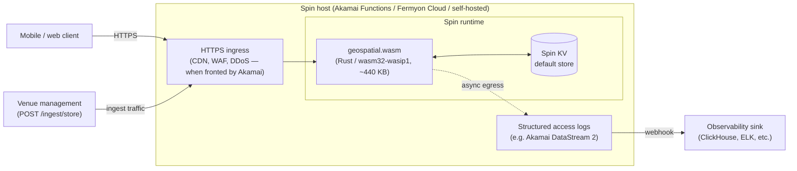
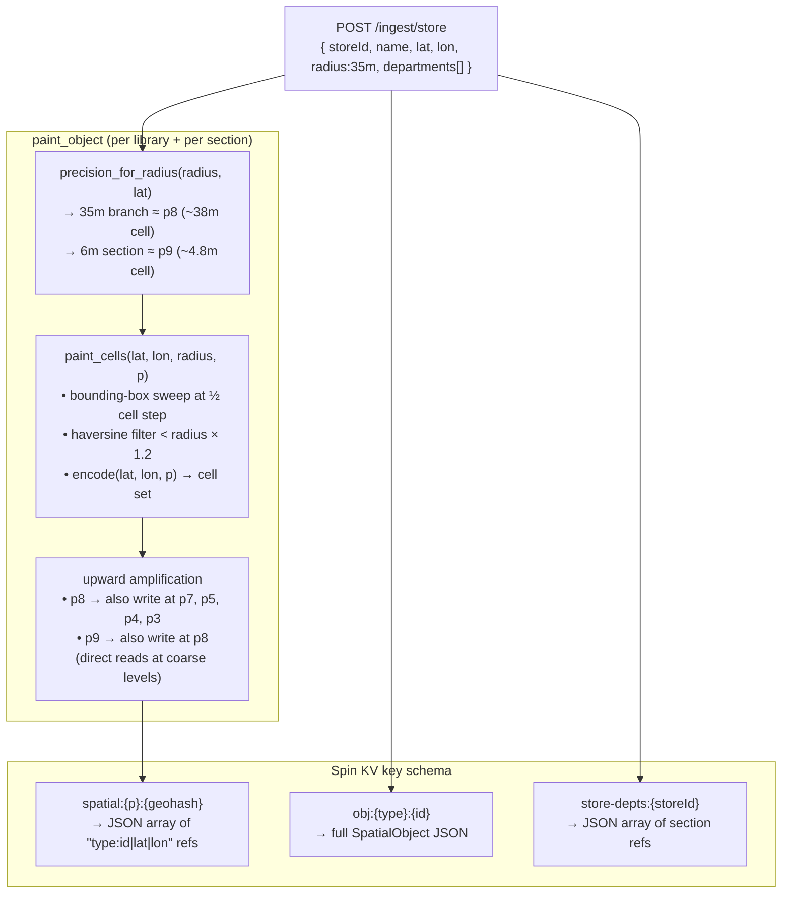
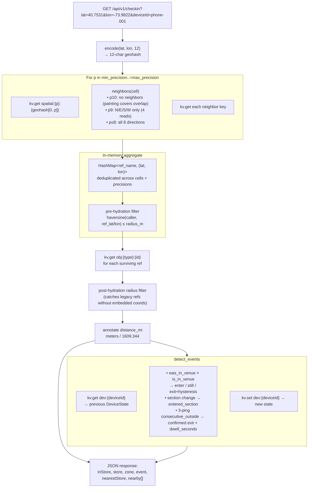

# Architecture & Data Flow

Three diagrams:

1. **System architecture** — where the WASM function sits on the Akamai Connected Cloud stack (or any Spin host).
2. **Ingest / cell painting** — how a library and its sections enter the spatial index.
3. **Query / location lookup** — how a visitor check-in resolves to a branch + section + entry/exit event.

All state lives in **Spin KV**. There are no external databases, scans, or secondary indexes.

---

## 1. System architecture

**Notes.** The WASM binary is deterministic and stateless — it can cold-start per-request in under a millisecond on Akamai Functions. State is in Spin KV, which is edge-local by default; replication across regions is a function of the host's KV implementation.

---

## 2. Ingest — cell painting + upward write amplification

**Why embed lat/lon in the ref.** `spatial:8:dr5ru6b` might hold `["store:nypl-mid|40.753182|-73.982253", ...]`. On the query path, we can run a haversine radius filter *before* fetching `obj:store:nypl-mid`, avoiding wasted KV reads when a dense geohash contains objects that are technically in-cell but far outside the caller's radius.

**Why upward amplification.** Spin KV is a flat key-value store — there's no `PREFIX` or `LIKE`. Writing a p8 library at p7/p5/p4/p3 converts a coarse-precision area query ("libraries in this neighborhood") into a direct single-key read.

---

## 3. Query — location lookup, dedup, event detection

**Typical cost.** A check-in at p9 with 4 neighbors + upward amplification reads at p8/p7 works out to ~15 KV reads per call — most served from the Spin KV process cache on repeat hits. P50 function-internal latency: **2–4 ms** on Akamai Functions.

**Event hysteresis.** A single "I don't see a venue" reading doesn't trigger an exit — `consecutive_outside` must reach 3 (typically ~30–60 seconds of pings) before we emit `device.exited_store`. This suppresses spurious exits from GPS jitter at the edge of a geofence.
